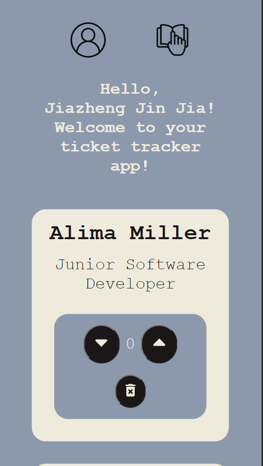
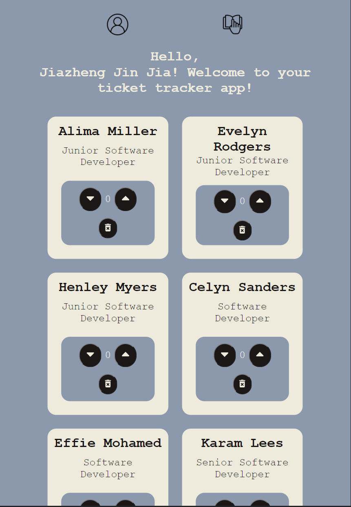
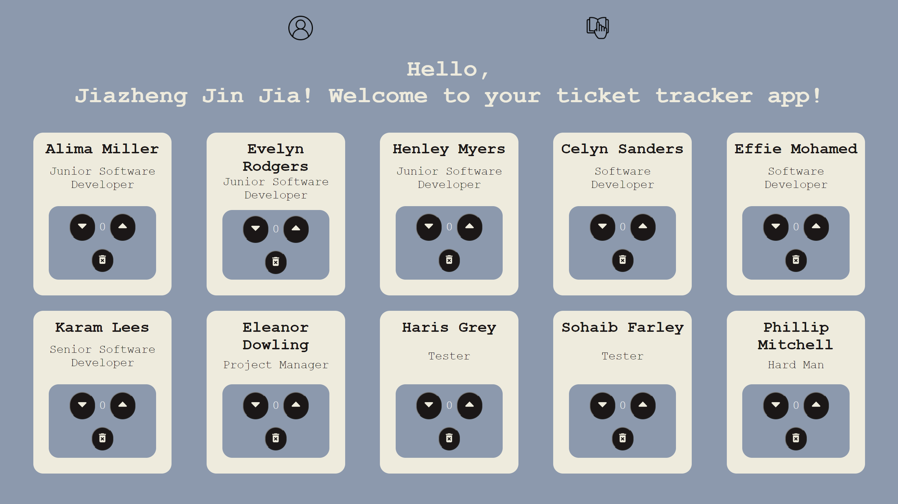

#Ticket Tracker

This project is created using React. Here's a link to the live site:

- https://j-jinjia.github.io/ticket-tracker/

The aims of this project were to practice React fundamentals(React components, props, functions as props).

# ABOUT

The ticket tracker was created with:

- Functinality and Layout: JSX and SASS (SCSS, and BEM notation)

It has a responsive design for:

- Mobile devices and tablets up to 768px
- Tablets and small laptops up to 1024px
- Pc monitors and larger devices from 1024px

I created this wireframe for the app using FIGMA

- https://www.figma.com/file/yMmSVZ7iWtLmXYwmZwUBBb/Ticket-Tracker-React?node-id=0%3A1

# Functionality

This ticket tracker can be used as follows:

- Read the instructions from the top of the page.
- CLick the buttons to add or substract tickets from the counter

# Features

With this ticket tracker you can:

- Personalise the greeting with your name by clicking into the settings icon
- Show the instructions on how to use the app clickin the information button
- Add tickets to the counter with the arrow up button
- Substract tickets to the counter with the arrow down button. The ticket count will start at 0.
- Delete tickets from the counter with the bin icon

# Preview

Mobile device  

Tablet device  

PC monitor or larger  

